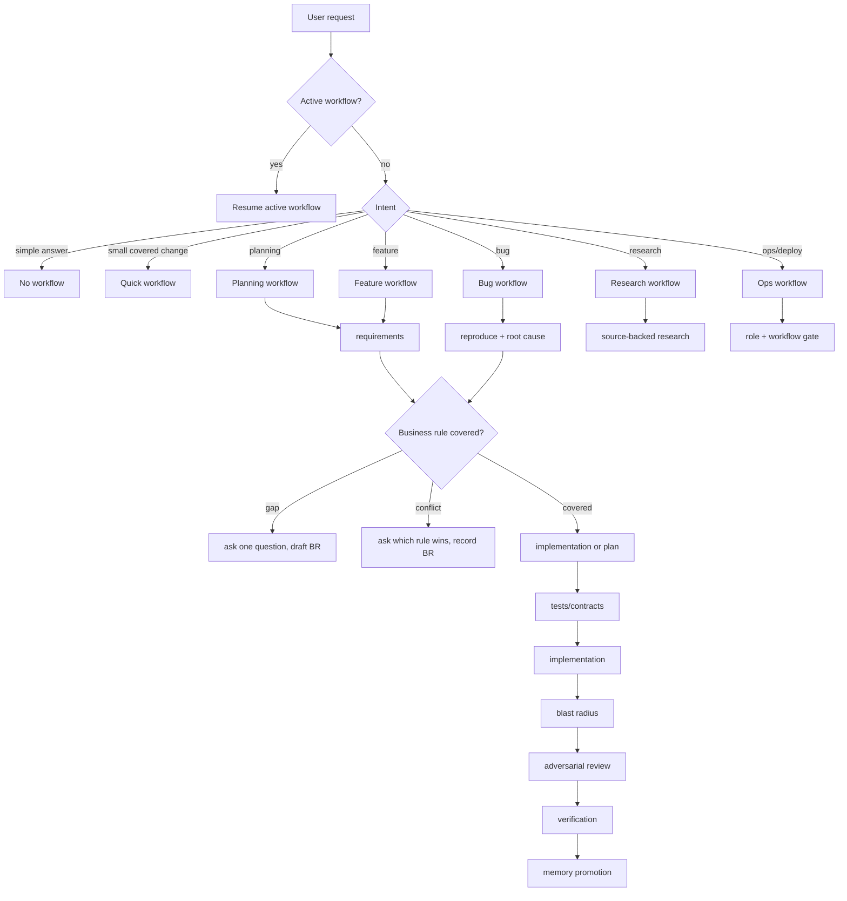

# aihaus-flow pkg port plan for aipi

## Scope inspected

- Source package: `C:\Users\vctrs\OneDrive\Documents\GitHub\aihaus-flow\pkg`
- Current source version: `pkg/VERSION` = `0.43.0`
- Current `aipi` repo state: empty git repository except `.git`
- Related engine source outside pkg: `C:\Users\vctrs\OneDrive\Documents\GitHub\aihaus-flow\aih-graph`

## What aihaus-flow pkg contains

The package is a Claude Code-first managed overlay, not a generic runtime library.
It installs a project-local `.aihaus` workspace and bridges it into `.claude`
through settings, hooks, agents, and skills.

Main surfaces:

- 59 usable specialist agents in `.aihaus/agents` (60 files including `.gitkeep`)
- 15 intent skills in `.aihaus/skills`
- 45 shell hooks in `.aihaus/hooks`
- workflow protocols in `.aihaus/protocols`
- markdown memory templates in `.aihaus/memory` and `.aihaus/templates`
- local kanban schema in `.aihaus/protocols/kanban/schema.sql`
- optional Go memory engine, `aih-graph`, installed as a binary but implemented outside `pkg`

Agent model distribution in current package:

- `sonnet`: 26 agents
- `opus`: 24 agents
- `haiku`: 9 agents

Agent tool distribution:

- read/search is nearly universal: `Read`, `Grep`, `Glob`
- most agents can run `Bash`
- 39 agents can `Write`
- only 8 agents can `Edit`
- 9 agents have web tools

This is a useful shape for a Pi port: planners/reviewers can use stronger
models, doers can use medium-cost coding models, and verifiers/context agents
can use cheaper models.

## Best reusable ideas

### 1. BDD business-rules ledger

The strongest product idea is the business-rules contract:

- business-visible decisions must be covered by a rule
- gaps pause and ask one question
- conflicts pause and ask which rule wins
- mechanics do not require user questions
- rules are written in BDD style with Given/When/Then scenarios
- rules link to code, tests, ADRs, and related rules

This maps directly to the user's desired "BDD orchestrator" behavior.

### 2. Workflow gates

The staged workflow is already close to the desired decision tree:

`backlog -> requirements -> planning -> tdd -> execution-review -> tests -> homolog -> human-review -> prod`

For `aipi`, keep the concept but simplify the first version:

`intake -> requirements -> rule-check -> plan -> implement -> blast-radius -> adversarial-review -> tests -> memory-promotion`

Add deployment stages only when the project has a configured deploy profile.

### 3. Memory layers

aihaus already has three practical layers, though not exactly with the target
names:

- code memory: `aih-graph` SQLite, FTS5/BM25, optional local Ollama embeddings,
  nodes for files, chunks, symbols, calls, tests, markdown memory, commits, rules
- project memory: `.aihaus/project.md`, `decisions.md`, `knowledge.md`,
  `.aihaus/memory/workflows/*.md`, kanban DB, run manifests
- user memory: global `~/.aihaus/memory/user/preferences.md` plus repo-local
  `.aihaus/memory/workflows/user-preferences.md`

For `aipi`, rename and formalize these as:

- `.aipi/memory/project/`: versioned Markdown source of truth for project
  state, BDD rules, decisions, procedures, deployment, glossary, and durable
  knowledge.
- `.aipi/state/aipi-graph.json` and `.aipi/state/aipi-graph.sqlite`:
  rebuildable graph/search/vector indexes over code, tests, Markdown memory,
  commits, runs, rules, and relationships.
- `.aipi/memory/user.local.md` or global user memory, with repo overrides.

Do not store personal global user preferences in git by default.

The important rule is that the index is not the memory. Runtime tools may use
`aipi-graph` for speed and relationship lookup, but any business-visible answer
or rule change must read the relevant Markdown page before acting. If
`.aipi/state/aipi-graph.json` and `.aipi/state/aipi-graph.sqlite` are deleted,
`aipi` should lose speed, not project knowledge.

### 4. Single-writer orchestration

aihaus's coordination rule is worth preserving:

- agents propose memory updates
- orchestrator applies memory updates
- one writer per shared file
- one writer per kanban transition
- parallel code writers must own disjoint file sets
- merge-back is sequential

This is the right concurrency model for a swarm product.

### 5. Guarded online boundary

aihaus has a real hook-enforced promotion boundary via `flow-guard.sh`.
For `aipi`, this should move into Pi tool interception:

- classify tool calls and shell commands
- block production/deploy actions outside tracked workflows
- optionally layer role policy such as `builder` vs `devops`
- audit blocked/allowed decisions

## What should not be copied directly

Do not copy the package wholesale into `aipi`.

Reasons:

- it is Claude Code-first and depends on `.claude/settings.local.json`
- hooks use Claude-specific events such as `PreToolUse`, `TaskCreated`,
  `SubagentStart`, `SubagentStop`, `Stop`, `SessionStart`, `SessionEnd`
- skills reference Claude-only tools such as `Agent`, `TaskCreate`,
  `TaskUpdate`, and `ExitPlanMode`
- prompts mention Claude Code native worktrees, native goal, native plan panel,
  and native task list
- installer logic is designed around `.claude` and global Claude skills
- some README badges/text are stale relative to `VERSION`

The portable asset is the system design, not the exact runtime surface.

## Recommended aipi architecture

Build `aipi` as a Pi package/extension first. Avoid a hard fork of Pi unless
an extension cannot implement required scheduling, event interception, or UI.

## Product autonomy contract

`aipi` should be contract-driven autonomy, not a generic coding assistant.

The client owns business meaning. The agent owns technical execution whenever
the business contract is sufficient.

Autonomy law:

- The user describes goals, rules, constraints, and acceptance criteria in
  business language.
- `aipi` turns that into explicit BDD contracts: rules plus Given/When/Then
  scenarios.
- Once the BDD contract is accepted, `aipi` proceeds autonomously through TDD,
  implementation, blast-radius analysis, review, tests, deployment planning
  suggestions, and memory promotion.
- `aipi` asks the user again only for a true contract blocker:
  - missing business-visible rule,
  - conflict between rules,
  - acceptance criterion that cannot be tested or verified,
  - production/security action outside the current role or workflow boundary.
- Pure technical choices are handled by agents using repo conventions,
  existing architecture, tests, and memory. They are recorded as ADRs or
  knowledge only when durable.

This means the main orchestrator should not expose implementation trivia to the
client as a choice unless the trivia changes business behavior, cost/risk, legal
constraints, data handling, deployment exposure, or accepted UX.

The default autonomous feature path after contract acceptance is:

`accepted BDD contract -> context/map -> failing tests/contracts -> implementation -> local verification -> blast radius -> adversarial review -> fixes -> final verification -> memory update`

Small, covered, low-risk changes can route through `aipi-quick` instead of the
full feature swarm. The quick lane is capped by owned-file count and blocked for
production, secrets, auth, payments, schema migrations, and destructive actions.

## Orchestrator session behavior

The main session is a persistent BDD orchestrator, not a normal coding chat.
It behaves more like a run controller:

- owns the current business contract,
- owns the active workflow stage,
- owns the run manifest and kanban state,
- decides which context is needed next,
- dispatches specialist agents,
- reads their artifacts,
- reconciles disagreements,
- asks the user only for business-rule blockers,
- advances the run autonomously when the contract is sufficient.

The orchestrator should default to not editing source code directly after the
workflow is non-trivial. It may make small mechanical edits, but normal code
mutation is delegated to implementation agents with an owned-file scope. The
orchestrator is the single writer for shared state and memory promotion.

Runtime loop:

1. Load active run state, BDD rules, project memory, user preferences, and code
   graph freshness.
2. Decide the next stage or gate.
3. Build the smallest useful context packet.
4. Spawn one or more specialist agents with explicit artifacts to return.
5. Inspect artifacts and evidence, not just final prose.
6. If agents disagree, run an adversarial/synthesis pass.
7. If the issue is technical, choose the safer path and proceed.
8. If the issue is business-visible and uncovered/conflicting, ask the user one
   focused question.
9. Persist state, evidence, and memory candidates.
10. Continue until the workflow target is reached or a true blocker remains.

This is the Fable-like behavior `aipi` should emulate: long-horizon ownership,
stage planning, sparse user questions, subagent delegation, self-review, and
verification. The implementation should come from Pi extension/runtime state,
not from hoping the prompt remembers every step.

## Swarm role

The swarm is not a separate product mode and it is not a loose team of coding
agents. It is the way `aipi` applies specialist pressure to the business-rule
contract.

Every swarm task receives:

- the accepted BDD rules and scenarios,
- any unresolved rule gaps or conflicts,
- relevant project memory and code graph context,
- the workflow stage it is serving,
- the exact artifact it must return.

The swarm can run before implementation:

- research domain or technical options,
- find analogs in the codebase,
- challenge assumptions in the BDD contract,
- identify rule conflicts,
- propose a safe implementation strategy,
- propose test strategy and acceptance evidence.

The swarm can run during implementation:

- split owned files,
- write tests/contracts,
- implement disjoint slices,
- check integration wiring,
- monitor blast radius against rules and call sites.

The swarm can run after implementation:

- adversarial review,
- security/privacy review,
- test gap review,
- deployment/homologation suggestion,
- rollback/checklist generation,
- final verification against each Given/When/Then scenario.

The invariant: swarm outputs do not override business rules. They either cite
the rule they are applying, propose a technical path under the rule, or raise a
rule gap/conflict for the orchestrator to resolve with the user.

Proposed repo shape:

```text
aipi/
  package.json
  src/
    extension.ts
    commands/
    workflows/
    agents/
    memory/
    policy/
    runtime/
  templates/
    .aipi/
      agents/
      protocols/
      workflows/
      memory/
  engines/
    aipi-graph/        # fork/adapt aih-graph, or import as external binary
  docs/
```

Core extension responsibilities:

- register commands: `/aipi-init`, `/aipi-workflow`, `/aipi-status`,
  `/aipi-memory`, `/aipi-profile`
- register tools for agents: `aipi_memory_query`, `aipi_rule_lookup`,
  `aipi_rule_gap`, `aipi_kanban_update`, `aipi_promote_memory`,
  `aipi_spawn_agent`
- inject project context on session/subagent start
- route natural-language requests into workflows
- choose agent type, provider, model, thinking level, and tool allowlist
- move accepted BDD contracts into autonomous TDD/execution runs
- coordinate swarm rounds for research, adversarial review, blast radius,
  implementation suggestions, test strategy, and deployment planning
- intercept risky tool calls and enforce workflow/role gates
- write audit and memory promotion records

Pi hook mapping is captured in `docs/pi-runtime-gates-hooks-map.md`. The short
version: use `before_agent_start` and `context` for BDD/profile/memory context,
`tool_call` and `user_bash` for hard policy gates, session hooks for resumable
run state, and SDK/RPC sessions for managed subagents.

## Behavioral discipline layer

The Fable skills repo adds an important missing layer to `aipi`: behavioral
disciplines. These are not workflows and not agents. They are small lifecycle
contracts that control how an agent spends context, changes code, verifies
claims, finishes a turn, and reports outcomes.

For `aipi`, keep these as first-class templates under `.aipi/disciplines/` and
activate them by workflow stage:

- `context-thrift`: task start and exploration;
- `scope-discipline` and `native-code`: before code edits;
- `prove-it`: before claims and state-changing tools;
- `finish-turn` and `outcome-first`: before ending a tool-using turn;
- `contract-first`: before business-visible choices.
- `complexity-review`: during review swarm, focused only on what can be
  deleted, replaced with stdlib/native features, or shrunk.

New discipline rules should be pressure-tested. A rule earns durable status
only after a baseline failure and a verified flip on the target model class.

## Agent catalog to port first

Start with a curated core agent set, not all 59.

Core orchestration:

- `bdd-orchestrator`
- `workflow-intake`
- `workflow-planning-gate`
- `context-curator`

Business and planning:

- `project-business-interviewer`
- `requirements-analyst`
- `business-rule-keeper`
- `plan-checker`
- `plan-calibrator`
- `contrarian`

Implementation and tests:

- `implementer`
- `test-writer`
- `code-fixer`

Review and blast radius:

- `code-reviewer`
- `integration-checker`
- `verifier`
- new `blast-radius`
- new `business-rule-conflict`

Memory:

- `codebase-mapper`
- `knowledge-curator`
- `user-profiler`

That is enough for a real feature workflow without carrying every historical
aihaus specialty prompt into the first Pi version.

## Model/provider strategy

Treat models as replaceable capacity, not as agent identity. Agents should bind
to a **class** and an **effort tier**; runtime policy resolves that pair to the
current provider/model/fallback chain.

Pi supports multiple providers and custom models, so `aipi` should keep model
selection in one policy file instead of embedding provider names in prompts.

Recommended class taxonomy:

| Class | Use | Context need | Typical model tier |
|---|---|---:|---|
| `orchestrator-heavy` | long-horizon run control, contract reconciliation | very high | best reasoning model available |
| `planner-heavy` | requirements, rule conflict, plan-checking | high | strongest configured planning model |
| `adversarial-heavy` | contrarian, security, hard reviews | high | strongest reviewer model |
| `research-heavy` | technical/domain research with citations | high | strong model with web/search tools |
| `code-strong` | implementation and code fixes | medium/high | Codex / Sonnet / strong GLM |
| `test-strong` | TDD, test design, verification contracts | medium | Codex / Sonnet / Opus when complex |
| `context-fast` | codebase mapping, retrieval summaries, memory checks | medium | GLM / Haiku / mini model |
| `verifier-fast` | deterministic final checks and artifact validation | low/medium | cheap reliable model |

Example policy shape:

```json
{
  "classes": {
    "orchestrator-heavy": {
      "capabilityFloor": {
        "reasoning": "frontier",
        "context": "very-high",
        "toolUse": "required"
      },
      "maxParallel": 1
    },
    "planner-heavy": {
      "capabilityFloor": {
        "reasoning": "high",
        "context": "high",
        "structuredOutputs": "required"
      }
    },
    "code-strong": {
      "capabilityFloor": {
        "coding": "high",
        "context": "medium-high",
        "toolUse": "write-capable"
      }
    },
    "context-fast": {
      "capabilityFloor": {
        "summarization": "high",
        "context": "medium",
        "citations": "required"
      }
    }
  },
  "agents": {
    "bdd-orchestrator": "orchestrator-heavy",
    "requirements-analyst": "planner-heavy",
    "business-rule-keeper": "planner-heavy",
    "contrarian": "adversarial-heavy",
    "implementer": "code-strong",
    "test-writer": "test-strong",
    "codebase-mapper": "context-fast",
    "verifier": "verifier-fast"
  }
}
```

Rules:

- Agent definitions describe job, artifacts, tools, and memory contract; they
  should not hardcode vendors.
- Model classes describe capability, context budget, effort, fallback, and cost
  ceiling.
- The runtime may override class resolution per repo, per workflow, per stage,
  or per user budget.
- Heavy agents should be scarce and mostly read/reason/review. Execution agents
  can use strong coding models with narrower context because the orchestrator
  and memory tools provide targeted context.
- Final verification should preferably use a different model family than the
  implementation model when cost allows.

## Decision tree for workflows



## Implementation slices

### Slice 0 - repo scaffold and contracts

- create Pi package skeleton
- add `.aipi` templates
- port protocols as neutral docs
- add business-rules template
- add workflow YAML definitions
- add behavioral discipline templates and seed pressure scenarios

### Slice 1 - Pi extension MVP

- `/aipi-init`
- `/aipi-status`
- `/aipi-workflow plan|feature|bug|research`
- `/aipi-workflow quick|plan|feature|bug|research|ops`
- no parallel agents yet
- write run manifests and project memory

### Slice 2 - agent registry and model routing

- translate the first 12 agents into Pi-compatible definitions
- create model policy and cohort mapping
- support per-agent tools and model/provider selection

### Slice 3 - memory engine

- fork/adapt `aih-graph` as `aipi-graph`, or vendor it as `engines/aipi-graph`
- expose memory tools from the extension
- index code, tests, rules, decisions, project memory, and user preferences
- add `rule`, `why`, `impact`, `callers`, and `query` APIs

### Slice 4 - real swarm workflows

- implement feature and bug workflows with subagent fan-out
- add disjoint owned-files planning
- add blast-radius and adversarial review gates
- add memory promotion from subagent outputs
- run behavior pressure scenarios against each model class before widening
  autonomous execution

### Slice 5 - policy and production boundary

- profiles: builder, reviewer, devops, business
- block prod/deploy actions unless role and workflow allow it
- record approvals and audit decisions

## Recommendation

Use aihaus-flow as the reference implementation for contracts and prompts, not
as the runtime base. The first `aipi` product should be:

1. Pi-native extension
2. `.aipi` project overlay
3. adapted `aipi-graph` memory engine
4. curated agent subset
5. BDD workflow gates
6. role-aware tool policy

This avoids dragging Claude-specific installer and hook mechanics into a Pi
project while preserving the valuable parts: BDD rules, local memory, staged
gates, specialist agents, and auditable orchestration.
